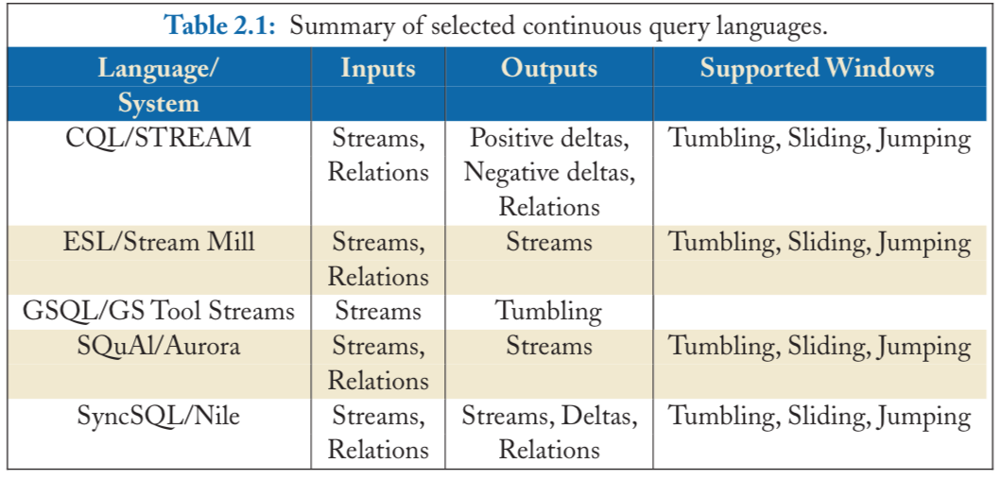

#CQL [Arasu et al., 2006],

## Streams, Relations and Windows
which is used by the STREAM DSMS, is a powerful language that supports streams, relations, sliding windows, and negative tuples

It contains three types of operators: 
- relation-to-relation operators that are similar to standard relational operators

- stream-to-relation: sliding windows that convert streams to time-varying relations. There classes of sliding window operators in CQL:
    + time-based
    + tuple-based
    + partioned
    + other types: fixed windows, tumbling windows, value-based windows

- relation-to-stream operators: Istream, Dstream and Rstream

    * The **Istream** ("insert stream")  operator compares the current output of the query (represented as a relation) with the output as of the current time minus one and returns only the new results. 

    * In contrast, at any time, **Dstream** ("delete stream") returns all the results that existed in the answer set at the current time minus one but do not exist at the current time. That is, Dstream returns all the negative tuples required to maintain a materialized view of the result. 

    * **Rstream** (relation stream) streams out the entire result at any given time.

Note:  [4]
```sql
rstream(now) = istream(range unbound) = select all values just arrive now
dstream(range 30 seconds) = select all values in the previous 30 seconds
```
More examples at :
http://infolab.stanford.edu/stream/sqr/


CQL supports sliding windows to convert streams to relations. Time-based windows of length N are specified with the **[RANGE N]** keyword following the reference to a stream. Count-based windows are denoted as **[ROWS N]**and partitioned windows on some attribute attr (recall Section 2.1.2) as **[PARTITION BY attr ROWS N]**. Win- dows containing only those tuples whose timestamps are equal to the current time are denoted as **[NOW]**, and a prefix of a stream up to now can be turned into a relation using **[RANGE UNBOUNDED]** or **[ROWS UNBOUNDED]**.


```sql
    SELECT Istream(*)
    FROM S [RANGE UNBOUNDED]
    WHERE source_IP_address = "1.2.3.4"
```

```sql  
    SELECT Rstream(*) FROM S [NOW]
    WHERE source_IP_address = "1.2.3.4"
```


In CQL, **JOIN** are usually expressed using Istream and sliding windows. In this case, the windows are implicit since Istream only generates new results. To express joins over explicit windows such as those in Figure 2.2, we need to write two queries:
     * one with Istream (positive deltas) and 

     * one with Dstream (negative deltas), and merge their results.


**SLIDE**: Computes the total traffic originating from each source over the last five minutes, with new results returned every minute:
```sql
    SELECT Rstream(source_IP_address, SUM(size)) 
    FROM S [RANGE 5 min SLIDE 1 min]
    GROUP BY source_IP_address
```

## User-defined Func
Most stream query languages support user-defined func written in an external languages. ESL allow SQL-base user-defined aggregates(**UDA**). And UDS consistss of three parts: *INITIALIZE*, *ITERATE*, *TERMINATE*

    * The first part initializes the required state, which must be stored in tables. 

    * The ITERATE statement is executed whenever a new tuple arrives. 

    * The TERMINATE statement is evaluated at the end of the input; a non-blocking UDA has an empty TERMINATE statement since it incrementally produces results as new tuples arrive.

Example :
```sql
    AGGREGATE Tumbling_window_avg(Next Int): Real {
        TABLE State(Tsum Int, Cnt Int);
        INITIALIZE: {
            INSERT INTO State VALUES (Next, 1);
        }
        ITERATE: {
            UPDATE State
              SET Tsum = Tsum + Next, Cnt = Cnt + 1;
            INSERT INTO Return
        
           SELECT Tsum/Cnt FROM STATE
              WHERE Cnt % 200 = 0;
            INSERT INTO State VALUES (Next, 1)
            WHERE Cnt % 200 = 1;
        }
          TERMINATE: {}
    }
```

## Sampling

CQL and SQuAl provide built-in random sampling. SQuAl includes a **DROP** operator, whereas CQL provides a **SAMPLE** keyword. For example, to obtain a one percent random sample of a stream S, we write 
```sql
SELECT * FROM S SAMPLE(1)
```

 GSQL provides a framework for expressing various sampling methods [Johnson et al., 2005a]. Users are required to write functions that describe the sampling technique, which are then referenced in the **HAVING**, **CLEANING WHEN** and **CLEANING BY** clauses. These clauses specify when to reset the state of the given sampling operator and which groups to return in the sample. ESL does not provide a separate sampling operator, but, similarly to GSQL, user-defined sampling algorithms may be written as UDAFs.



For a broader comparison, we refer the interested reader to an article by [6]

### Common Construct [4]
1. Stream filters
2. Stream-Relation joins
3. Sliding-window joins
4. Streaming aggregations

### Example 
http://infolab.stanford.edu/stream/sqr/

### REWRITTING [4]
1. Window Reduction
2. Filter-window commutativity

[4]: ArasuA,BabuS,WidomJ.The CQL continuous query language: semantic foundations and query execution. Very Large Databases Journal (VLDBJ). 2006;15(2):121–142.

[5]: Lukasz Golab, M. Tamer Özsu. Data Stream Management. Synthesis Lectures on Data Management, Morgan & Claypool Publishers 2010   , page 9

[6] M. Cherniack and S. Zdonik. Stream-oriented query languages and operators. In L. Liu and M. T. Özsu, editors, Encyclopedia of Database Systems, pages 2848–2854. Springer, 2009. DOI: 10.1007/978-0-387-39940-9_368 22